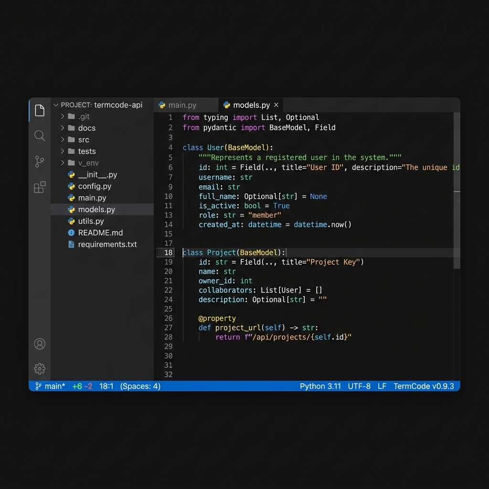

# TermCode 🖥️

A developer-focused terminal text editor mapping classic VS Code workflows. Built entirely in Python using the modern Textual TUI framework.

TermCode brings a full-featured side panel (with a directory explorer, file creator, and recursive workspace search), a mouse-interactive multi-tab layout, and a command palette straight to your terminal emulator.

<p align="center">
  
</p>

---

## Key Features

* **VS Code-like Activity Bar & Side Panel**: Toggle instantly between your File Explorer and Workspace Search.
* **Workspace Action Controls**: Create files, folders, or delete paths directly from the TUI interface.
* **Multi-Tab File System**: Dynamic, mouse-responsive tab headers displaying open files.
* **Interactive Command Palette (`Ctrl+P`)**: Search files by name, or type `>` to execute editor commands.
* **Find & Replace Panel (`Ctrl+F`)**: Real-time workspace search and replacement with case-insensitivity.
* **Asynchronous Workspace Search**: Text scanning runs on separate background worker threads with keyboard debouncing to guarantee zero input lag.
* **Full Mouse Interactivity**: Switch tabs, open files, expand folders, and click controls natively with your mouse.
* **Universal Cross-Platform Runners**: Bundled launchers for Linux, macOS, and Windows.

---

## Default Keyboard Shortcuts

| Shortcut | Action | Description |
| :--- | :--- | :--- |
| `Ctrl + P` | **Command Palette** | Filter and open workspace files or trigger commands (by typing `>`) |
| `Ctrl + B` | **Toggle Sidebar** | Expand or collapse the Explorer/Search side panel |
| `Ctrl + F` | **Find & Replace** | Open the Find/Replace panel; press `Escape` to dismiss and focus the editor |
| `Ctrl + S` | **Save File** | Save changes in the active editor tab back to disk |
| `Ctrl + W` | **Close Tab** | Close the active editor tab |
| `Ctrl + Q` | **Exit** | Safely close TermCode |
| `Escape` | **Dismiss Panels** | Dismiss modals or the Find/Replace panel and return focus to editor |

---

## Installation & Setup

### 1. Global Installation (Recommended)
You can install TermCode globally in editable mode. This will automatically compile and register a native binary (`termcode` / `termcode.exe`) on your system PATH.

```bash
# Clone the repository
git clone https://github.com/coolguynova/TermCode.git
cd TermCode

# Install globally in editable mode
pip install -e .
```

Once installed, you can launch the editor in any workspace folder simply by running:
```bash
termcode
```

---

### 2. Running Locally (No installation)
If you want to run TermCode directly from the cloned repository without installing it globally:

#### On Linux/macOS
Use the absolute-path-aware runner script:
```bash
./termcode
```

#### On Windows (Command Prompt)
```cmd
termcode.cmd
```

#### On Windows (PowerShell)
```powershell
.\termcode.ps1
```

---

### 3. Adding to System PATH (Linux/macOS Symlink Option)
If you prefer not to install the package via `pip` but still want to run the local cloned repository from any folder, you can symlink the runner script into your user binaries directory:

```bash
ln -sf "$(pwd)/termcode" ~/.local/bin/termcode
```
*(Make sure `~/.local/bin` is in your environment's `$PATH`).*

---

## Development & Contribution

TermCode uses standard PEP-517 packaging. The package structure is separated into clean modules:
* `src/core/editor.py`: Low-level, non-blocking file operations, search algorithms, and binary guards.
* `src/ui/app.py`: Main Textual App, layout widgets, tabs management, and event controllers.
* `src/ui/command_palette.py`: Autocomplete file finder and command console.

To contribute, clone the repo, set up a virtual environment, and run:
```bash
python -m venv .venv
source .venv/bin/activate
pip install -r requirements.txt
```
